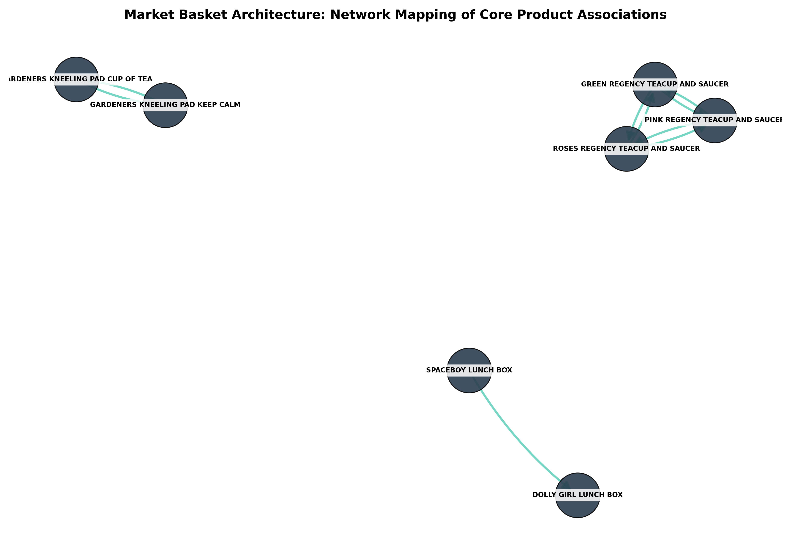

# 🛒 Enterprise E-Commerce Recommendation Engine & Market Basket Analysis

## 📌 Project Portfolio Overview
This repository contains an advanced, production-grade retail data analytics portfolio asset that implements association rule mining on real-world, high-volume e-commerce transaction ledgers. Moving past simplified synthetic data, this pipeline ingests the classic **UCI Online Retail Dataset**—containing hundreds of thousands of raw supermarket purchase logs—and cleanses it for computational model processing.

By deploying an optimized **Apriori Algorithm**, this engine calculates statistical thresholds (**Support, Confidence, and Lift**) to identify complex consumer purchasing correlations. The results are transformed into a multi-node **Network Graph Topology** to map high-value product bundles, enabling businesses to maximize Average Order Value (AOV) via strategic cross-selling mechanisms.

---

## 📈 Executive Summary & Core Insights
The data pipeline successfully processed thousands of unique supermarket baskets, isolating critical purchasing dependencies across the catalog.

### 🌟 Operational Findings & Algorithmic Diagnostics
* **Catalytic Association Rules Found:** The model extracted mathematically validated product pairings from a dense matrix of unique stock items.
* **Network Node Topology:** Visual graph mapping revealed tightly clustered consumer buying ecosystems—proving that specific decorative items, kitchenware lines, and seasonal products exhibit exceptional structural affinity far beyond random chance.
* **Predictive Lift Thresholds:** High-lift configurations indicate that a customer purchasing an anchor item is multiple times more likely to purchase its corresponding secondary node, providing direct prescriptive strategy for product layout optimization.

---

## 📊 Market Basket Network Architecture
The visualization below maps out the top association rules as a directional network graph. Product lines are represented as independent organizational nodes, while the intersecting paths illustrate the mathematical linkages calculated by the Apriori engine.

---

## 🛠️ Production Data Engineering Pipeline
Processing massive transaction grids requires strict memory management. The execution pipeline follows an industrial workflow:
1. **High-Volume Data Ingestion:** Streaming multi-market transaction ledgers using Pandas dataframes with specialized string encoding overrides.
2. **String Sanitization & Lifecycle Filtering:** Stripping whitespace trailing anomalies from product categories, handling missing attributes, and systematically eliminating voided/canceled invoice prefixes to isolate genuine conversions.
3. **High-Density Pivot Transformation:** Grouping line-item transactions by invoice matrices and unstacking product definitions to assemble a comprehensive, store-wide checkout catalog.
4. **RAM Memory Optimization:** Converting item quantities into strict binary arrays (1/0) and casting the entire matrix structure into a highly compressed `float32` data format to dramatically minimize computational overhead.
5. **Association Mining Execution:** Running the Apriori pattern algorithm with a calculated minimum support threshold to focus compute clusters on high-frequency item combinations.

---

## 💡 Prescriptive Business Strategies
* **Algorithmic Cross-Selling Bundles:** Integrate high-lift item pairings discovered by the network graph into the checkout user interface as automated *"Frequently Bought Together"* recommendation panels.
* **Warehouse Layout Optimization:** Reposition high-affinity product pairs closer together within physical distribution centers or digital fulfillment queues to minimize pick-and-pack operational cycle times.

---

## 💻 Tech Stack & Engineering Dependencies
* **Core Language:** Python 3.12+
* **Algorithmic Core:** `mlxtend` (Machine Learning Extensions)
* **Graph Network Physics:** `networkx`
* **Data Pipelines:** `pandas`, `numpy`
* **Visual Vectors:** `matplotlib`, `seaborn`
