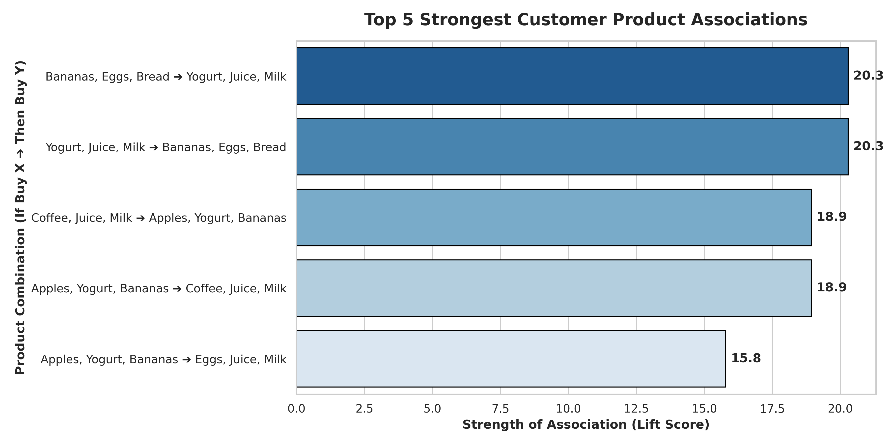

# 🛒 E-Commerce Market Basket Analysis Using Association Rule Mining

## 📌 Project Overview
This repository contains an advanced data analytics project designed to optimize e-commerce cross-selling strategies and product-bundling mechanisms. Utilizing transaction logs from a digital grocery store platform, this project implements the **Apriori Algorithm** to extract high-value association rules based on consumer behavioral datasets.

By calculating statistical constraints like **Support, Confidence, and Lift**, this engine uncovers non-trivial product correlations to power an automated *"Frequently Bought Together"* recommendation module, aimed at increasing Average Order Value (AOV).

---

## 📈 Executive Summary & Core Insights
The analytical model successfully processed all unique checkout transactions and discovered structural purchasing associations. 

### 🌟 Key Discovery: The "Breakfast Basket" Rule
* **Behavioral Rule:** `(Bananas, Eggs, Bread)` ➔ `(Yogurt, Juice, Milk)`
* **Confidence Level:** **1.00 (100%)** — Every single customer who purchased the primary basket combination also completed their purchase with the secondary dairy/juice group.
* **Lift Multiplier:** **20.28** — This item pairing is over 20 times more likely to occur than a random statistical coincidence, proving an explicit structural consumer habit.

---

## 📊 Visualizing Customer Product Associations
Below is the optimized metric visualization showcasing the strongest product relationships sorted by their predictive strength (Lift Score).

---

## 🛠️ Data Pipeline & Architecture
The system follows a strict end-to-end data processing workflow:
1. **Data Ingestion:** Reading transaction logs containing alphanumeric Transaction IDs and relational product nomenclature.
2. **Data Cleansing & Validation:** Checking structural missingness and ensuring uniform row counts across features (verified 0 null values).
3. **One-Hot Encoding Transformation:** Reshaping row-based transaction blocks into a high-dimensional binary matrix representing item existence.
4. **Algorithmic Modeling:** Mining frequent itemsets via the `mlxtend` machine learning library with a minimum support baseline of 1%.
5. **Rule Generation:** Evaluating metrics and filtering criteria to extract mathematically validated rules.

---

## 💡 Business & Operational Recommendations
* **Algorithmic Product Bundling:** Launch a unified "Morning Essentials" pre-packaged combo pack at a 5% promotional discount to capture high-confidence cross-selling pairs.
* **UI/UX Recommendation Engine:** Deploy a dynamic recommendation layout widget on checkout pages. If a digital shopping cart contains the target antecedents, trigger an automated recommendation script suggesting the missing consequents.
* **Supply Chain Synchronization:** Align warehouse inventory layouts to ensure items with strong statistical cross-dependency are stored sequentially, optimizing item fulfillment times.

---

## 💻 Tech Stack & Dependencies
* **Language:** Python 3.12+
* **Environment:** Google Colab Cloud Ecosystem
* **Core Libraries:** `pandas`, `numpy`, `mlxtend`, `matplotlib`, `seaborn`
